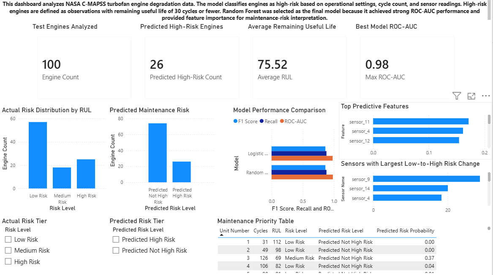

# Aerospace Predictive Maintenance & Engine Failure Risk Modeling

## Project Overview

This project uses NASA C-MAPSS turbofan engine degradation data to build a predictive maintenance workflow for aerospace operations. The goal is to classify engines as high-risk or not high-risk based on operational settings, cycle count, and sensor readings.

The project follows a full data science workflow: raw data cleaning, remaining useful life labeling, exploratory data analysis, SQL-based risk summaries, machine learning model training, and Power BI dashboard reporting.

## Business Problem

Aerospace and aviation maintenance teams need to identify equipment that may be approaching failure before it causes operational disruption. Instead of waiting for failure, predictive maintenance models can help prioritize inspections and support risk-based maintenance planning.

In this project, a high-risk engine is defined as an engine observation with:

```text
Remaining Useful Life <= 30 cycles
```

The model output is designed to support a maintenance-priority workflow, where engines with higher predicted failure-risk probability are inspected first.

## Dataset

The project uses the NASA C-MAPSS turbofan engine degradation dataset.

For the first version, only the FD001 subset was used because it is the simplest version of the dataset:

- 1 operating condition
- 1 fault mode
- 100 training engines
- 100 test engines
- 21 sensor readings
- 3 operational setting columns

The raw data includes:

- `train_FD001.txt`
- `test_FD001.txt`
- `RUL_FD001.txt`

The raw text files were converted into clean labeled CSV files for analysis and modeling.

## Tools Used

- Python
- Pandas
- NumPy
- Scikit-learn
- SQLite
- SQL
- Power BI
- Matplotlib
- Seaborn

## Project Structure

```text
aerospace-predictive-maintenance/
│
├── data/
│   ├── raw/
│   ├── processed/
│   └── outputs/
│
├── notebooks/
│   ├── 01_data_loading_cleaning.ipynb
│   ├── 02_eda_sensor_degradation.ipynb
│   └── 03_modeling_failure_risk.ipynb
│
├── sql/
│   ├── 01_create_tables.sql
│   ├── 02_risk_analysis.sql
│   └── 03_sensor_summary.sql
│
├── dashboard/
│   ├── powerbi_screenshots/
│   └── README_dashboard_notes.md
│
├── reports/
│   └── executive_summary.md
│
├── README.md
└── requirements.txt
```

## Data Cleaning and Labeling

The raw NASA files do not include readable column names, so I assigned structured labels for:

- Engine ID
- Cycle number
- Operational settings
- Sensor readings

The training data is run-to-failure data, so remaining useful life was calculated as:

```text
RUL = max cycle for engine - current cycle
```

Then I created risk labels:

```text
High Risk: RUL <= 30
Medium Risk: 31 <= RUL <= 75
Low Risk: RUL > 75
```

For modeling, I created a binary target:

```text
1 = High Risk
0 = Not High Risk
```

This binary target was stored as `high_risk_flag`.

## Exploratory Data Analysis

The EDA focused on understanding engine degradation patterns and maintenance-risk groups.

Key analysis areas included:

- Engine lifetime distribution
- RUL distribution
- Risk label counts
- Average RUL by risk tier
- Sensor differences between low-risk and high-risk observations
- Sensor trends across engine lifecycle stages

The EDA helped identify sensor channels that changed most between low-risk and high-risk observations.

## Machine Learning Modeling

Two classification models were trained:

1. Logistic Regression
2. Random Forest Classifier

The target variable was:

```text
high_risk_flag
```

The model used these feature groups:

- Time in cycles
- Operational settings
- 21 sensor readings

RUL was not used as an input feature because it was used to create the target label.

## Model Results

| Model | Accuracy | Precision | Recall | F1 Score | ROC-AUC |
|---|---:|---:|---:|---:|---:|
| Logistic Regression | 0.93 | 0.846 | 0.88 | 0.863 | 0.979 |
| Random Forest | 0.93 | 0.846 | 0.88 | 0.863 | 0.983 |

Random Forest was selected as the final model because it matched Logistic Regression on accuracy, precision, recall, and F1 score while achieving slightly higher ROC-AUC. It also provided feature importance, which made the model easier to interpret.

## Dashboard Summary

A Power BI dashboard was created to translate model outputs into an operations-focused maintenance view.

Main dashboard KPIs:

- Test engines analyzed: 100
- Predicted high-risk engines: 26
- Average remaining useful life: 75.52 cycles
- Best model ROC-AUC: 0.98

Dashboard sections include:

- Fleet risk overview
- Actual vs predicted risk distribution
- Model performance comparison
- Maintenance priority table
- Top predictive features
- Sensor change analysis

## Dashboard Preview



## SQL Analysis

The cleaned CSV outputs were loaded into a SQLite database:

```text
data/outputs/aerospace_maintenance.db
```

SQL queries were written to analyze:

- Risk label counts
- Average RUL by risk tier
- Engine lifetime summaries
- Top maintenance-priority engines
- Actual vs predicted high-risk classifications
- Top predictive features
- Sensor differences between low-risk and high-risk observations

## Key Takeaways

- The Random Forest model achieved strong classification performance with 93% accuracy, 88% recall, and 0.983 ROC-AUC.
- The model flagged 26 out of 100 test engines as predicted high-risk.
- Feature importance and sensor-change analysis helped identify which variables were most useful for risk classification.
- The maintenance-priority table translated model predictions into a ranked inspection workflow.
- The final dashboard connects machine learning results to operational decision-making.

## Business Recommendations

- Prioritize inspection for engines with the highest predicted failure-risk probability.
- Use model predictions as decision support, not as automatic replacement decisions.
- Monitor sensor channels with the strongest differences between low-risk and high-risk observations.
- Combine model outputs with maintenance history and engineering judgment before final action.
- Track recall carefully because missing a high-risk engine is more costly than creating an extra inspection flag.

## How to Run This Project

1. Install dependencies:

```bash
pip install -r requirements.txt
```

2. Run the notebooks in order:

```text
01_data_loading_cleaning.ipynb
02_eda_sensor_degradation.ipynb
03_modeling_failure_risk.ipynb
```

3. Run SQL queries from:

```text
sql/01_create_tables.sql
sql/02_risk_analysis.sql
sql/03_sensor_summary.sql
```

4. Open the Power BI dashboard file from:

```text
dashboard/aerospace_predictive_maintenance_dashboard.pbix
```

## Project Status

Completed first version:

- Data cleaning complete
- EDA complete
- Model training complete
- SQL analysis complete
- Power BI dashboard complete
- Dashboard screenshots added
- Executive summary included